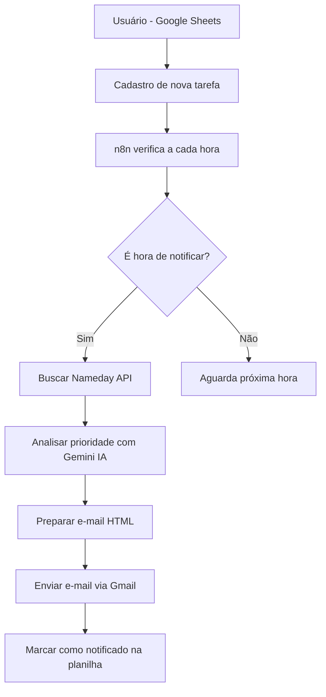

# 📋 Controle de Tarefas

Sistema de automação inteligente para gerenciamento de tarefas usando n8n, Google Sheets, IA e Gmail.

## 📖 Sobre o Projeto

O **Controle de Tarefas** automatiza o gerenciamento de atividades do dia a dia. Por meio da integração entre Google Sheets, n8n, Inteligência Artificial e Gmail, o sistema identifica tarefas cadastradas em uma planilha, analisa sua prioridade e envia uma notificação por e-mail no horário agendado.

**Problema que resolve:** Dificuldade em organizar, priorizar e acompanhar tarefas de forma prática e automatizada.

## ✨ Funcionalidades

- ✅ Leitura automática de tarefas no Google Sheets a cada hora
- ✅ Filtro por data e horário agendado
- ✅ Análise de prioridade com IA (Gemini)
- ✅ Envio de e-mail HTML formatado
- ✅ Marcação automática de tarefas já notificadas
- ✅ Ignora tarefas com status concluído (`C`)

## 🗂️ Estrutura da Planilha

| Coluna | Descrição | Exemplo |
|--------|-----------|---------|
| `task` | Nome da tarefa | Estudar para prova |
| `description` | Descrição detalhada | Revisar capítulos 1 a 5 |
| `status` | Status atual (`C` = concluído) | URGENTE |
| `priority` | Prioridade informada | ALTA |
| `date` | Data agendada | 30/05/2026 |
| `time` | Horário agendado | 14:00 |
| `notificado` | Preenchido automaticamente (`S`) | S |

## 🏗️ Arquitetura

## 🛠️ Tecnologias

- [n8n](https://n8n.io) — Automação de workflows
- [Google Sheets](https://sheets.google.com) — Cadastro de tarefas
- [Google Gemini](https://ai.google.dev) — Análise de prioridade com IA
- [Gmail API](https://developers.google.com/gmail) — Envio de e-mails
- [Nameday API](https://nameday.abalin.net) — Curiosidade do dia

## 🚀 Como usar

1. Clone o repositório
2. Importe o arquivo `Controle de Tarefas .json` no n8n
3. Configure as credenciais: Google Sheets OAuth2, Gmail OAuth2 e Gemini API
4. Crie a planilha com as colunas da tabela acima
5. Ative o workflow

## 👥 Integrantes

| Nome | GitHub |
|------|--------|
| Otávio Felix da Silva | [@OtavioFelix-in](https://github.com/OtavioFelix-in) |
| Felipe Veríssimo Oliveira | [@FelipeV21](https://github.com/FelipeV21) |
| Leonardo Henrique dos Santos | [@LeonardoHSantos1612](https://github.com/LeonardoHSantos1612) |
